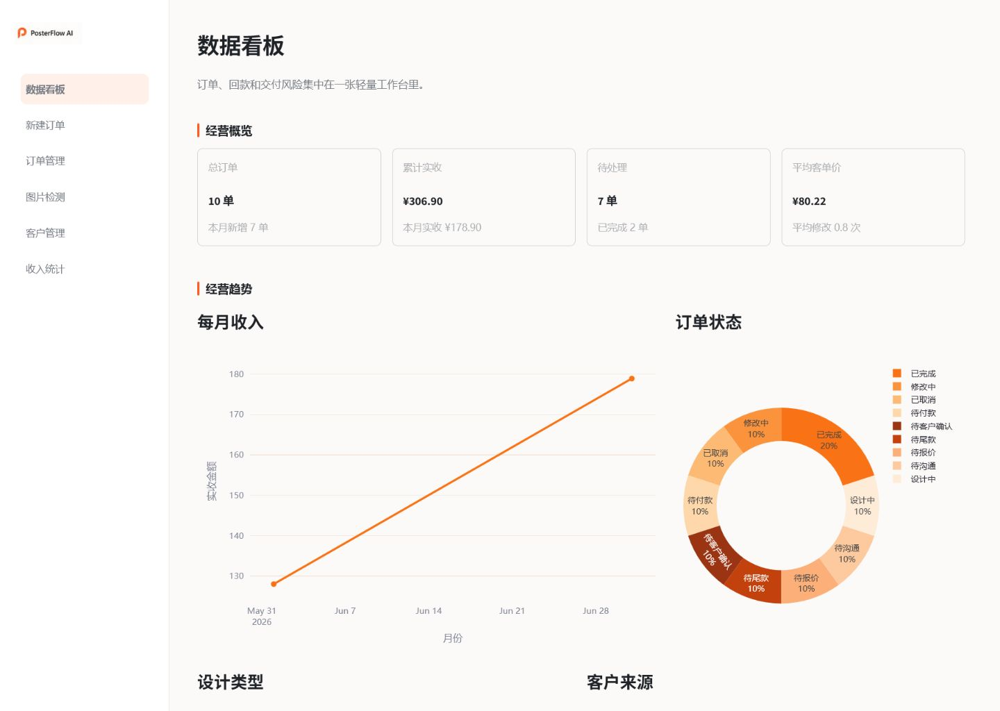
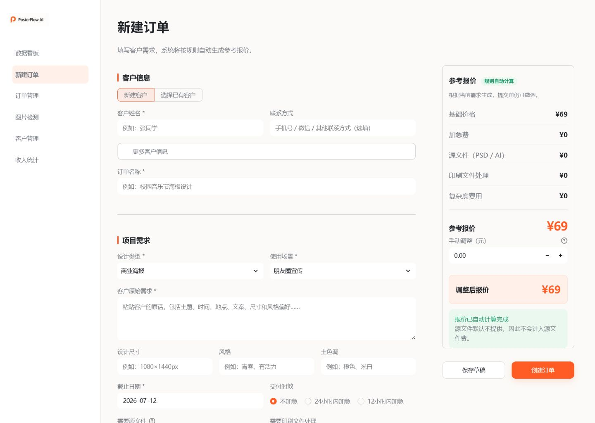
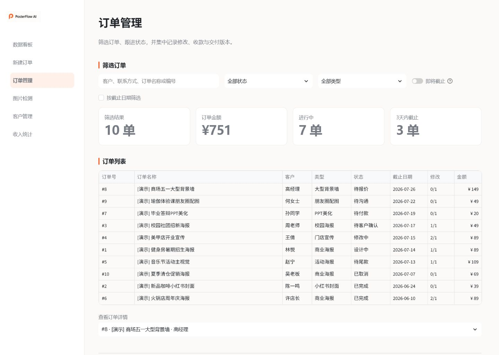
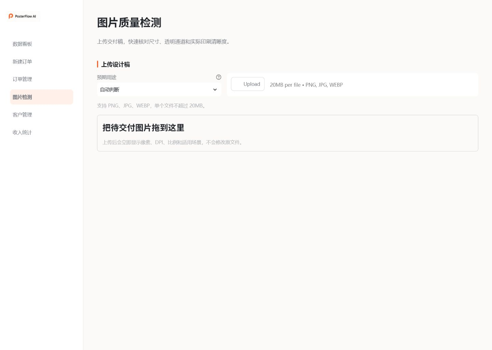

# PosterFlow AI


PosterFlow AI 是一套面向个人设计师和大学生接单者的海报接单与交付管理工具。第一版聚焦真正影响日常接单效率的环节：客户建档、订单流转、规则报价、修改次数、图片清晰度和收入统计。

> **当前状态：v1.0.0 稳定业务底座。** 第一版用可测试的业务规则和数据流程解决接单管理问题；AI 需求解析、缺失信息追问和客户确认话术将在 v1.1.0 加入。

界面采用暖白底色与橙色强调的轻量工作台风格，适合在电脑端持续录入和查看。系统默认只交付 PNG、JPG 或 PDF 成品；当订单选择“**不需要源文件**”时，不提供 PSD / AI 可编辑文件，也不会计入源文件加价。

## 第一版已实现

- 创建客户并记录联系方式、来源与备注
- 创建订单，保存原始需求、用途、尺寸、风格、截止日期等信息
- 根据设计类型、加急、印刷、复杂度等规则生成参考报价
- 按状态、客户、日期和设计类型筛选订单，并编辑、删除或更新状态
- 记录每次修改，区分免费修改与额外收费
- 上传 PNG、JPG、WEBP，检测像素、格式、文件大小、DPI、比例和透明通道
- 输入实际印刷厘米尺寸，计算横向、纵向和有效打印 DPI，并给出风险等级
- 记录定金、尾款、全款、修改费和退款，统计实收与待收金额
- 查看订单状态、设计类型、客户来源和月度收入图表
- 使用 SQLite 持久化保存数据，关闭应用后数据不会丢失

第一版不包含 AI 文案、AI 绘图、在线 PSD 编辑、在线支付、多人协作或复杂权限。项目不会用未实现功能包装“AI”，后续进度以 [ROADMAP.md](ROADMAP.md) 为准。

## 技术栈

- Python 3.12
- Streamlit 1.59
- SQLAlchemy 2.0 + SQLite
- Pillow
- Pandas + Plotly
- Pytest（开发与测试依赖）

## 快速开始

### Windows PowerShell

```powershell
py -3.12 -m venv .venv
.\.venv\Scripts\Activate.ps1
python -m pip install --upgrade pip
python -m pip install -r requirements.txt
Copy-Item .env.example .env
python scripts\seed_demo.py
streamlit run app.py
```

完成依赖安装后，也可以运行：

```powershell
.\scripts\start.ps1
```

### macOS / Linux

```bash
python3.12 -m venv .venv
source .venv/bin/activate
python -m pip install --upgrade pip
python -m pip install -r requirements.txt
cp .env.example .env
python scripts/seed_demo.py
streamlit run app.py
```

浏览器通常会自动打开 `http://localhost:8501`。如果没有自动打开，请手动访问该地址。

## 演示数据

运行以下命令会加入 10 条中文模拟订单，覆盖不同客户来源、订单状态、设计类型、修改记录和付款进度：

```powershell
python scripts\seed_demo.py
```

脚本可以重复运行，已经存在的演示订单不会重复创建。演示订单标题以 `[演示]` 开头，便于识别。SQLite 数据默认保存在 `database/posterflow.db`。

## 页面说明

| 页面 | 主要用途 |
| --- | --- |
| 数据看板 | 查看订单、实收、待处理、客单价、修改次数和经营图表 |
| 新建订单 | 选择或创建客户，填写需求并生成规则报价 |
| 订单管理 | 搜索、筛选、查看详情、更新状态并记录修改 |
| 图片检测 | 检查图片元数据和实际印刷 DPI 风险 |
| 客户管理 | 创建客户，查看历史订单、累计实收和修改画像 |
| 收入统计 | 记录定金与尾款，查看待收金额和收入结构 |

## 项目结构

```text
posterflow-ai/
├── app.py                    # Streamlit 入口与侧栏导航
├── pages/                    # 看板、订单、图片、客户和财务页面
├── database/
│   ├── db.py                 # 数据库连接与事务管理
│   └── models.py             # 客户、订单、报价、修改、付款等模型
├── services/
│   ├── quote_service.py      # 报价规则
│   ├── image_service.py      # 图片与打印 DPI 检测
│   └── statistics_service.py # 经营数据汇总
├── utils/                    # 常量、校验、文件与安全工具
├── ui/                       # 主题和共享界面组件
├── scripts/
│   ├── seed_demo.py          # 10 条幂等演示数据
│   └── start.ps1             # Windows 快速启动
├── tests/                    # 报价、图片、数据库和安全测试
├── .github/workflows/        # GitHub Actions 自动测试
├── CHANGELOG.md              # 版本变更记录
├── ROADMAP.md                # 长期迭代路线
├── uploads/                  # 本地上传文件（仅保留 .gitkeep）
├── outputs/                  # 本地导出文件（仅保留 .gitkeep）
└── database/posterflow.db    # 运行时自动生成，不提交 Git
```

## 报价与收入口径

参考报价由基础价格和可选加价组成：

```text
最终报价 = 基础价格 + 加急费 + 源文件费 + 印刷处理费 + 复杂度费用 + 手动调整
```

页面中的“实收”来自付款记录，不等同于订单报价。退款会从实收中扣除；“待收金额”按有效订单应收金额减去净实收计算。额外修改费会计入订单应收。

## 图片检测口径

图片中写入的文件 DPI 只是一项元数据。实际打印清晰度按像素和成品厘米尺寸重新计算：

```text
打印 DPI = 图片像素 ÷ 打印尺寸（英寸）
1 英寸 = 2.54 厘米
```

- 300 DPI 以上：高质量印刷
- 150–299 DPI：普通印刷
- 72–149 DPI：远距离观看可接受
- 72 DPI 以下：存在明显模糊风险

大型喷绘通常从较远距离观看，但仍建议在交付前与印刷供应商确认出血、色彩模式、文件比例和设备要求。

## 配置与安全

复制 `.env.example` 为 `.env` 后再填写本机配置。请遵守以下规则：

- 不要把 `.env`、真实 API 密钥、客户数据、SQLite 数据库或上传文件提交到 GitHub
- 数据库写入通过 SQLAlchemy 参数化完成
- 密码工具使用带随机盐的 PBKDF2-SHA256，不保存明文密码
- 上传图片仅允许 PNG、JPG、WEBP，默认限制为 20MB
- 对重要数据定期备份 `database/posterflow.db`
- 上线部署时使用独立数据库、HTTPS 和平台密钥管理，不要沿用开发环境配置

第一版尚未启用登录注册，`users` 表和密码工具用于后续扩展。

## 运行测试

```powershell
python -m pip install -r requirements-dev.txt
python -m pytest -q
```

当前版本共有 17 项测试，覆盖数据库增删改查、报价计算、图片元数据与印刷 DPI、上传安全和密码哈希。推送或提交 Pull Request 后，GitHub Actions 会在 Python 3.12 环境自动安装依赖并运行测试。

## 项目截图

项目已在 1440×1024 桌面视口完成浏览器验收，截图保存在 `docs/screenshots/`：

- `dashboard.png`：有演示数据的数据看板
- `new-order.png`：新建订单与实时报价
- `order-management.png`：订单列表和修改记录
- `image-checker.png`：图片信息与印刷风险
- `customer-management.png`：客户画像
- `finance.png`：收入趋势和付款记录

### 数据看板



### 新建订单与自动报价



### 订单管理



### 图片质量检测



重新截图前先运行 `python scripts/seed_demo.py`，并保持相同浏览器宽度，以便在 GitHub 和简历中呈现一致效果。

## 后续规划

| 版本 | 目标 |
| --- | --- |
| v1.1.0 | AI 需求解析、缺失信息追问、可解释报价和客户确认话术 |
| v1.2.0 | 修改意见拆解、设计版本管理和交付检查 |
| v1.3.0 | 报价单、交付报告和经营分析 |
| v2.0.0 | 登录、云端数据库、在线部署和产品化架构 |

详细任务和每日迭代规则见 [ROADMAP.md](ROADMAP.md)。

## 许可证与数据说明

代码采用 [MIT License](LICENSE)。项目当前用于学习、作品集和个人接单管理。演示客户均为虚构数据；请勿把真实客户隐私直接公开到仓库或项目截图中。发布前请完成 [Release Checklist](docs/RELEASE_CHECKLIST.md)。
